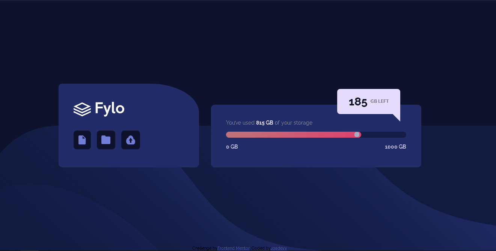
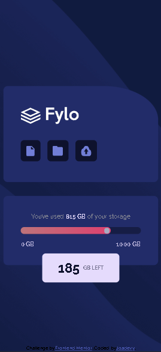

**Welcome everybody to my little project! 👋**

## Live site 🚀
- Live Site URL: [Add live site URL here](https://your-live-site-url.com)

## Table of contents
  - [Live Site](#live-site)
  - [Overview](#overview)
  - [The challenge](#the-challenge)
  - [Screenshot](#screenshots)
  - [My process](#my-process)
  - [Built with](#built-with)
  - [What I learned](#what-I-learned)
  - [Continued development](#continued-development)
  - [Useful resources](#useful-resources)
  - [Author](#author)
  - [Contact me](#Got-feedback-or-any-comment-for-me?)

## Overview
This is my solution to the [Fylo data storage component challenge on Frontend Mentor](https://www.frontendmentor.io/challenges/fylo-data-storage-component-1dZPRbV5n). 

### The challenge

- Reply the design of the component as well as possible and make it responsive for 375px and 1280px resolutions.

### Screenshots

## My process

### Built with

- Semantic HTML5 markup
- Flexbox
- CSS Grid
- Mobile-first workflow
- SASS for nesting, module and custom properties.

### What I learned

On this project I learned about SASS, it's my first time using this technology and it was really cool. I used it to nesting and module my code. I know this technology has many more uses but for my first time it's fine, I'll keep working on it.

### Continued development

I'm really excited to keep learning about frontend technologies, specially about going into javascript in order to create dynamic webs. I want to learn git too because it's important and useful for co-working. I'll working on that when I feel confortable with my HTML/CSS skills.

### Useful resources

- [Cliph-path maker](https://bennettfeely.com/clippy/) - This helped me for apply a polygon decoration in a button of "GB Left". I really liked this pattern and will use it going forward.

## Author

- Frontend Mentor - [@Joadevy](https://www.frontendmentor.io/profile/Joadevy)
- Twitter - [@jjoadev](https://twitter.com/jjoadev)

## Got feedback or any comment for me?

- Contact me in twitter or post in one of my solutions of Frontend-mentor and probably I'll learn you. 

**Have a good day!** 🚀